## 阅读须知
- 本篇文章面向人群是接触过 Category theory (范畴论) 以及 函数式编程，但未曾接触过 Yoneda Lemma (米田引理) 的读者食用。
- 通篇对于范畴论内的专有名词一律采用了英文词汇的形式表达，以防中文翻译各类型文章不统一，可能存在误导性。
- 文章中可能会存在一些 Agda 或 Haskell 语言的代码。没有相关知识不要紧，这只是给予相关领域的朋友一个直觉，用以辅助说明的。
- 这是我在知乎发布的第一篇文章，如对文章本身抱有任何疑问或是纠错欢迎提出，在此感谢各位！

## 前言
[Yoneda Lemma (米田引理)](https://en.wikipedia.org/wiki/Yoneda_lemma) 是范畴论里面一个有关函子的态射实质上可被映射至固定对象上的重要结论，使我们得以透过该引理去推导出更多的定理出来，或者透过该引理观察某些结构上的微妙联系，而对应到计算机编程上亦可擦出火花，比如 Yoneda-embedding 与 CPS 变换 的关系等等。当然，本篇文章主要目的皆指在于引导读者一步步地推导出 Yoneda Lemma，以及给予相应的直觉。

由于 Yoneda Lemma 涉及到一些范畴论上的前置知识，因此在介绍 Yoneda Lemma 之前，首先从 hom-set 开始讲起。

## Hom-set (Hom-集合) 
就函数而言，比方说从 $\Bbb{Z}$ 到 $\Bbb{Z}$ 之间的映射存在的可能不止有仅仅一条函数，它可能还存在着很多不同的函数，诸如 $f,\ g,\ h, ... : \Bbb{Z} \to \Bbb{Z}$ 等等。而由这一束函数所组成的集合，在范畴论中则被称之为 hom-set，即由 morphism(s) 所组成的集合。

由集合作为 object 所组成的 category 则被称之为 category of sets (集合范畴)，它们之间的 morphism(s) 即是 hom-set(s)，因此也可被称为 locally small category (局部小范畴)。

### 定义
给定 object $x,\ y$ 于 locally small category $C$ 内，hom-set 则是所有从 object $x$ 到 $y$ 的 morphisms 所形成的搜集，记为 $Hom_C(x,\ y)$ （这里的 $C$ 为 category 的名字，或是 $C(x,\ y)$，并且可省略地记为 $Hom(x,\ y)$）。

### 例子
设有 category $C$，并且有： <br/>
1. Objects：$a,\ b \in obj(C)$ <br/>
2. Morphisms：$f : a \to b$，$g : a \to b$，$h : a \to b$

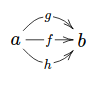

## Hom-functor (Hom-函子)

由于 Yoneda Lemma 涉及到 hom-functor 的概念，因此 hom-set 肯定是不足够表达 Yoneda Lemma 含义的，我们还需要事先定义一下何为 hom-functor。而 hom-functor 共分为三种，分别是 covariant，contravariant 以及 mixed-variant hom-functor。

### Covariant Hom-functor (协变 Hom-函子)
我们都知道在 object 之间的 morphism(s) 所组成的集合是 hom-set。而对于 hom-functor 而言，通俗的说即是把 object 从原来的 category 中映射为 hom-set，并且把 morphisms 映射为 hom-sets 之间的 morphisms，进而建立 (covariant) hom-functor 的概念。

那么该如何构造出这一概念？对于这一疑问，我们可以先假设有 locally small category $C$ 以及一些 object，例如 $X, A, B \in obj(C)$，然后 对于所有 $X$ 将作为 fixed object，并且分别有 $X$ 到 $A$ 以及 $X$ 到 $B$ 的 hom-sets。那么 (covariant) hom-functor 的样子是这样的：

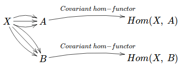

从上图可见，当把 $X$ 给固定住后，object $A$ 将会映射为一个 $Hom(X,\ A)$，$B$ 则被映射为 $Hom(X,\ B)$，所以说只要把其中一边给固定住了 (这里固定了 hom-set 的左侧，而右侧可变的位置是协变位，因此称为 covariant hom-functor)，对于任何可变的 object (这里则指 $A$ 或 $B$)，便可透过 (covariant) hom-functor 被映射成 hom-set 了。

当然，除了 object 以外，我们还需设想 morphisms 的情况。<br/>
现在设 $A$ 和 $B$ 之间存在 morphism $f$，那么对于 morphisms 而言，被映射至 $Set$ 之后便是这样：

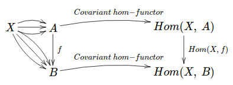

即 morphism $f$ 将被映射成 $Hom(X,\ f)$ (这里可以理解为 $Hom(id_X,\ f)$)。

那么便可总结出规律，想要定义出 hom-functor 的概念，必须要知道到底 objects 是应该怎样被映射的，morphisms 亦应怎么被映射的，并且证明其满足 functor laws，最终便可定义出 covariant hom-functor 了。

### 定义
设有 locally small category $C$，固定 $C$ 下的 object $X$ 为 fixed object，有：<br/>
1. Objects：$A, B \in obj(C)$，$Hom(X,\ A)$，$Hom(X,\ B) \in obj(Set)$<br/>
2. Morphisms：$f : A \to B, g : X \to A \in mor(C)$，$Hom(X,\ f) \in mor(Set)$

则 $Hom(X, -) : C \to Set$ (或 $h_X$) 被称为 covariant hom-functor，并有如下图表：

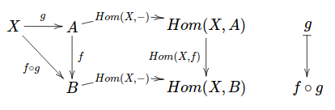

而 covariant hom-functor 由以下两部分组成：<br/>
$obj(C) \to obj(Set)$：$\forall A \in obj(C)，有 A \mapsto Hom(X,\ A)$<br/>
$mor(C) \to mor(Set)$：$\forall f \in A \to B$，$g : Hom(X,\ A)$，有 $g \mapsto f \circ g$

Covariant hom-functor 本身结构是 $F : C \to Set$，因此也可被称为 representable functor (可表函子) 。

### 证明
Identity laws：$Hom(X, id_A) = id_A$<br/>
Composition laws：$Hom(X,\ g \circ f) = Hom(X,\ g) \circ Hom(X,\ f)$

由此可见 covariant hom-functor 满足 functor laws，因此它是一个 functor。

### Contravariant Hom-functor (逆变 Hom-函子)
而 contravariant hom-functor，只需把 covariant hom-functor 中 domain (逆变位置) 或 codomain (协变位置) 其中任意一个 category 改为 opposite category，这里我们采用改变逆变位置的 category，即有：

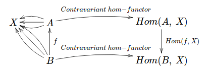

### 定义
设有 locally small category $C^{op}$，固定 $C$ 下的 object $X$ 为 fixed object，并且有：<br/>
1. Objects：$A, B \in Obj(C^{op})$，$Hom(A,\ X), Hom(B,\ X) \in obj(Set)$<br/>
2. Morphisms：$f : B \to A, g : A \to X \in mor(C)$，$Hom(f,\ X) \in mor(Set)$<br/>

则 $Hom(-, X) : C \to Set$ (或 $h^X$) 被称为 contravariant hom-functor，并有如下图表：

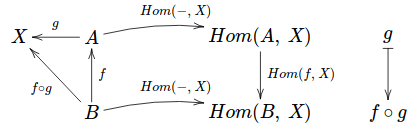

而 contravariant hom-functor 由以下两部分组成：<br/>
$obj(C^{op}) \to obj(Set)$：$\forall A \in obj(C^{op})$，有 $A \mapsto Hom(A,\ X)$<br/>
$mor(C^{op}) \to mor(Set)$：$\forall f \in B \to A$，$g : Hom(A,\ X)$，有 $g \mapsto f \circ g$

Contravariant hom-functor 本身结构是 $F : C^{op} \to Set$，于拓扑里有另外一个名字，称之为 presheaf (预层) 。

### 证明
Identity laws：$Hom(id_A, X) = id_A$<br/>
Composition laws：$Hom(g \circ f,\ X) = Hom(g,\ X) \circ Hom(f,\ X)$

由此可见 contravariant hom-functor 满足 functor laws，因此它是一个 functor。

### Mixed-variant Hom-functor (双变 Hom-函子)
Mixed-variant hom-functor 相较于上述的 covariant 及 contravariant hom-functor，最大的区别是它能同时接受两个变元，即 $Hom(-, -) : C^{op} \times C \to Set$，因此被称为 mixed-variant hom-functor，该 functor 是一个 $Id_C$ 的 profunctor，亦可被视为是一个 bifunctor 的结构。

### 定义
设有 locally small category $C$ 并且有 $C$ 的 opposite category $C^{op}$<br/>
Objects：$A, A' \in Obj(C^{op})$，$B, B' \in Obj(C)$<br/>
Morphisms：$f : A' \to A$，$h : B \to B'$<br/>
Functors：$Hom(-, X) : C^{op} \to Set$，$Hom(X, -) : C \to Set$

那么即有图：

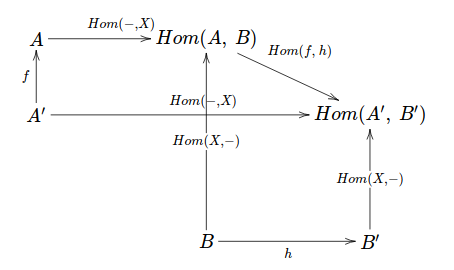

而由于 $Hom(X, -)$ 以及 $Hom(-, X)$ 二者皆是从某个 category 中 morphism 至 $Set$，因此该处可构成一 product category (乘积范畴)，即 $C^{op} \times C$，所以有 functor $Hom(-, -) : C^{op} \times C \to Set$：

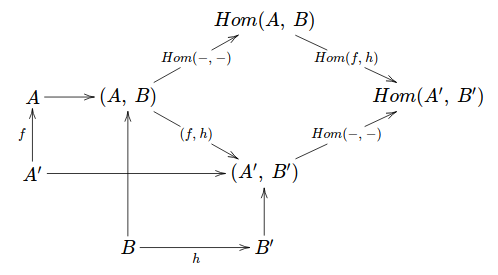

而对于 $Set$ 中 $Hom(f,\ h) : Hom(A,\ B) \to Hom(A',\ B')$，假设固定任意一边的变元为 $id$，那么 morphisms 则为：$Hom(id_A,\ h) : Hom(A, B) \to Hom(A, B')$，$Hom(f,\ id_B) : Hom(A,\ B) \to Hom(A',\ B)$，$Hom(id_{A'},\ h) : Hom(A', B) \to Hom(A', B')$，$Hom(f,\ id_{B'}) : Hom(A,\ B') \to Hom(A',\ B')$，所以会有图：

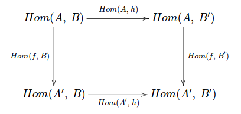

为了证明该图可交换，现在假设有 $g \in Hom(A,\ B)$，那么有：

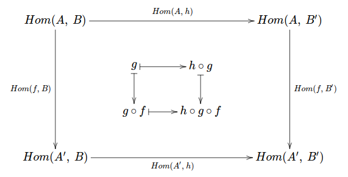

最终得出结论：$g \mapsto h \circ g \circ f : Hom(A,\ B) \to Hom(A',\ B')$，因此该图可交换。

## Yoneda Lemma
在把上述的 hom-set，hom-functor 等概念定义完毕后，现在我们终于可以开始来谈谈何为 Yoneda Lemma 了，首先我们从它的定义开始。

### 定义
1. 设 $C$ 为任意的 locally small category 以及有 category $Set$
2. 固定某个 object $X \in Obj(C)$
3. Functors：$Hom(X, -) : C \to Set$，一个任意的 functor $F : C \to Set$

而 Yoneda Lemma 所描述的即设有任一的对于 $Hom(X, -)$ 与 $F$ 之间的 natural transformation (自然变换) $\alpha$，它与 $x \in F(X)$ 即可视为是 isomorphic 的。换句话说即对于集合 $F(X)$，它必定能够一对一地把 objects 从 $F(X)$ bijection 至 $Hom(Hom(X, -),\ F)$ 集合上的 functor。

米田引理的形式化定义如下：

$$ [C,\ Set](Hom(X, -),\ F) \cong F(X) $$

其中 $[C,\ Set]$ 是一 functor category (函子范畴)，object 为 functor，morphisms 则为 natural transformations。
有些时候我们也能把 functor category 替换成 $Set$，其含义是一样的，因此有：

$$ Hom(Hom(X, -),\ F) \cong F(X) $$

### 透过交换图观察米田引理的结构
由于文字叙述往往不是很直观，因此让我们从交换图的角度来观察一下米田引理：

首先定义 $A, B \in Obj(C)$，且有态射 $f : A \to B$，以及一个任意的 object $X$，因此对于 category $C$，我们有：

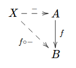

因此对于任意 $X$，我们可以定义出 morphism $- : X \to A$ 以及 $f \circ - : X \to B$。

而后考虑到有 functor $Hom(X,\ -) : C \to Set$ 和 $F : C \to Set$，以及有一自然变换 $\alpha : Hom(X, -) \to F$，我们能够得出如下图：

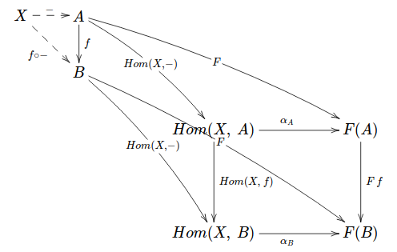

所以在 category $Set$ 中，有<br/>
Objects：$Hom(X,\ A), Hom(X,\ B), F(A), F(B)$<br/>
作为 Morphisms 的 Functors：$Hom(X,\ f) : Hom(X,\ A) \to Hom(X,\ B)$，$F\ f : F(A) \to F(B)$<br/>
作为 Morphisms 的 Natural transformations：$\alpha_A : Hom(X,\ A) \to F(A)$，$\alpha_B : Hom(X,\ B) \to F(B)$。

对于 category $Set$，由于 $(F\ f) \circ \alpha_A = \alpha_B \circ Hom(X,\ f)$，因此该图可交换。 

### 证明
为了证明米田引理，可以取出 $Hom(X,\ A)$ 中的 identity morphism $id_X$ 作为实例，即 $Hom(X,\ X)$，所以上图将更变为：

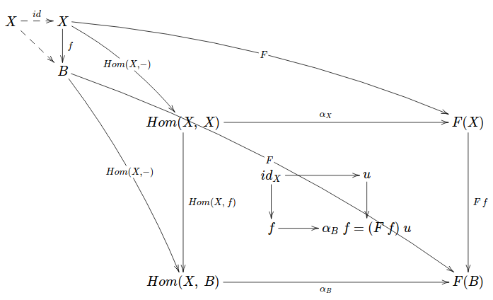

其中包含了 $id_X \in Hom(X,\ X)$，$u \in F(X)$，$f \in Hom(X,\ B)$ 以及 $\alpha_B\ f \in F(B)$。

而现在我们要做的仅仅是证出该图中所有的 natural transformation $\alpha$ 与 functor $F$ 之间是 isomorphic 的，因此需要证明出 $toYoneda : \forall X \in C. (\forall \varphi \in C. Hom(X,\ \varphi) \to F(\varphi)) \to F(X)$ 以及 $fromYoneda : \forall X \in C. F(X) \to (\forall \varphi \in C. Hom(X,\ \varphi) \to F(\varphi))$ 这两条路是行得通的，所以最终得出证明：<br/>

设 $\alpha_\varphi : \forall \varphi. Hom(X,\ \varphi) \to F(\varphi)$：<br/>
$toYoneda$：$id : Hom(\varphi,\ \varphi)$，有 $\alpha_\varphi\ id = u$<br/>
$fromYoneda$：$u : F(\varphi)$，有 $\alpha_\varphi\ f = (F\ f)\ u$

至此证毕。

#### 于 Agda 中的表达
```
toYoneda : (C : Category o m) {X : Obj C} {F : Functor C (𝒮ℯ𝓉 m)}
           → [ C , 𝒮ℯ𝓉 m ]⟨ Hom C [ X ,─] , F ⟩
           → Fₒ F X
toYoneda
  record { id = id }
  record { η = η }
  = η id

fromYoneda : {C : Category o m} {X : Obj C} (F : Functor C (𝒮ℯ𝓉 m))
             → Fₒ F X
             → [ C , 𝒮ℯ𝓉 m ]⟨ Hom C [ X ,─] , F ⟩
fromYoneda
  record { Fₘ = Fₘ }
  u
  = record { η = λ f → (Fₘ f) u }
```

注：该部分只写出了最终的证明步骤，需要查看详尽的前置定义及源码可移步至 [这里](http://home.e7mc.com:12450/9032676/category-research)。

#### 于 Haskell 中表达
```
toYoneda :: (forall a. (x -> a) -> f a) -> f x
toYoneda alpha = alpha id

fromYoneda :: f x -> (forall a. (x -> a) -> f a)
fromYoneda u f = fmap f u
```

注：该证明被直接翻译为 Haskell 中 category theory 的语义，所以与 agda 中把所有在证明过程中所使用的 concept 全部构造出来是有所区别的。

## 结语
至此，Yoneda lemma 证明篇正式完毕，而接下来笔者将会撰写两篇后续的文章，重点讨论 Yoneda embedding (米田嵌入) 与 Continuation passing style (CPS 变换) 的关系，以及 co-Yoneda lemma 的证明。在此感谢各位细心阅览！

## 外部链接
本文部分内容参考或引用至下列网页，也可供作为额外的延伸资源帮助阅读：

- [Yoneda lemma - nLab](https://ncatlab.org/nlab/show/Yoneda+lemma)
- [The Yoneda Lemma - Bartosz Milewski](https://bartoszmilewski.com/2015/09/01/the-yoneda-lemma/)
- [Category Theory II 4.1: Representable Functors](https://www.youtube.com/watch?v=KaBz45nZEZw)
- [Category Theory II 4.2: The Yoneda Lemma](https://www.youtube.com/watch?v=BiWqNdtptDI)